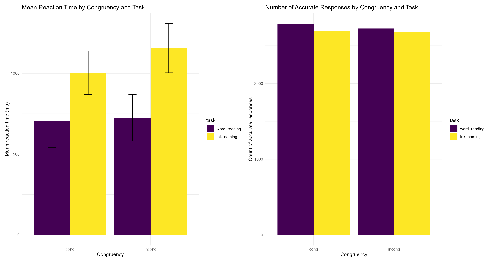
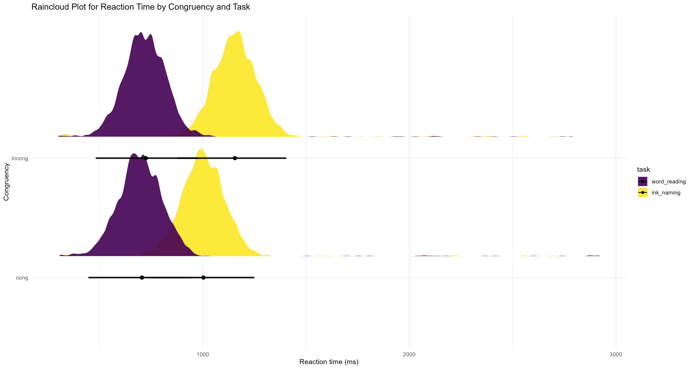

# Stroop Analysis
## Overview
This project contains an analysis of the Stroop task from R course for beginners week 8 assignment. 

## Scripts in this project
### 1. Pre-processing script from collected to raw data
This script proccesses the collected Stroop task data, binding individual files of each subject's trials, preparing the data for filtering and further analysis. 
### 2. Pre-processing script from raw to filtered data
This script proccesses the raw Stroop task data, filters NA trials of subjects and summarizes the number of filtered trials. 
### 3. Statistical analyses of the Stroop task
This scripts performs:
- Descriptive statistics of both reaction time and accuracy, by task type (ink naming or word reading) and congruency (color and word are congruent or incongruent). 
- Descriptive plots for reaction time and accuracy:

- Mixed models analysis for predicting reaction time by task type and congruency, with subjects' identity as a random effect. Results indicate that reaction time is higher for ink naming compared to word reading, and that this difference is higher when the color of the word is incongruent with the ink color.
 
